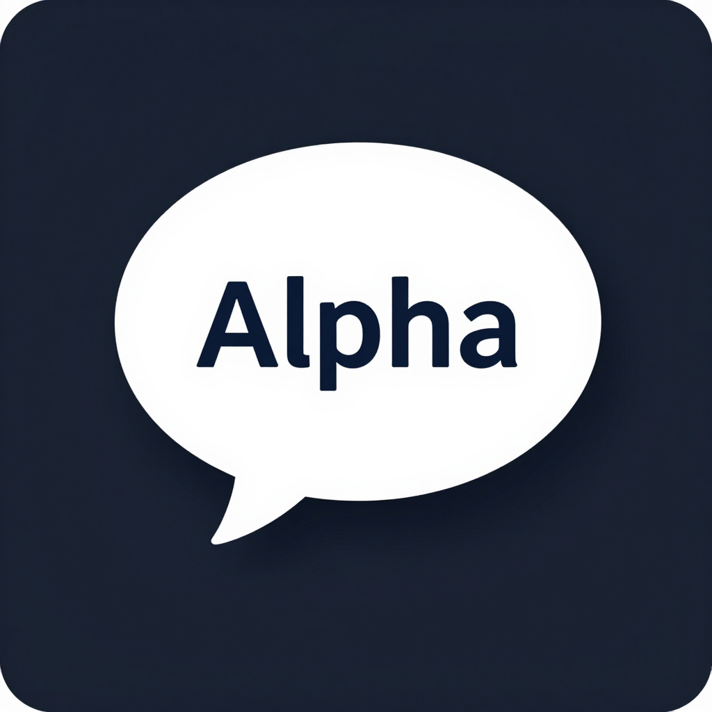

<h2>Alpha</h2>

中文 | [English](README.en.md)

Alpha 是一个开源 AI 代码编辑器，由 [DeepSeek Harness](https://github.com/deepseek-ai/deepseek-harness) 演进而来。它采用 **一切皆插件** 架构，由 [Cordis](https://github.com/cordiverse/cordis) 驱动；桌面端、Web 端与 CLI 共用同一套 agent 内核、会话格式和插件图。

### 一、功能简述

- 桌面端（Tauri）、Web 端与 CLI 三个入口共用同一个 agent 内核、会话格式和插件图，一个插件写一次即可在三端装载。
- 安装包内置 Python、Node.js 和 pnpm 三套独立运行时，首次使用即可执行 Python 数据处理、Office 文档读写和 Node 脚本，不依赖用户机器上的系统环境。
- 终端、SSH、子进程、沙箱、LSP、浏览器操作和计算机操作等能力都以插件形式提供，按需启停。
- 会话全程落盘且可回放：任何进入模型请求的输入都能从会话日志中重建，便于审计和复现。
- 三平台安装包由 GitHub Actions 在发布 release 时自动构建。Windows 输出 NSIS 安装程序，macOS 输出 ad-hoc 签名的 DMG（Apple Silicon 与 Intel 各一个），Linux 输出 AppImage。
- 应用 ID 为 `org.mutantcat.alpha`，数据目录沿用 `$DSH_HOME`，升级不丢失既有 profile。

### 二、部署方式

1. 从 [Releases](https://github.com/Mutantcat-Working-Group/Alpha/releases) 下载对应平台的安装包，双击即可安装运行，无需额外配置。
2. 只想试用 Web 版时，安装 Node.js 后执行 `npx @mutantcat/dsh web`，默认在 `http://127.0.0.1:3080` 打开；`--no-open` 只起服务不打开浏览器。

3. 从源码运行需要 Node.js `^22.19` 或 `>=24` 与 pnpm，依次执行 `pnpm install`、`pnpm run build`、`pnpm dsh web`。
4. 自行打包某个平台的安装包，在 `apps/desktop` 下执行 `pnpm run package:ci:tauri:<target>`，`<target>` 取 `mac:arm64`、`mac:x64`、`win:x64`、`linux:x64`、`linux:arm64` 之一。产物落在 `.desktop-build/targets/<target>/artifacts/`。

### 三、快速上手

1. 首次启动后在输入框描述任务，agent 自行规划、调用工具并汇报结果；运行中的任务、排队输入和后台作业都会在重启确认里给出中断提示。
2. 左下角账号区显示更新状态，可手动检查更新；桌面版支持自动下载和重启安装。
3. 需要脚本和数据处理时，agent 直接使用安装包内置的 Python 运行时，无需手动准备解释器或 pip 环境。
4. 更多细节见 [Web UI 指南](docs/user/guide/index.md)、[架构文档](docs/architecture.md) 和 [开发指南](docs/development.md)。

### 四、插件与兼容

- Alpha 完整保留 DeepSeek Harness 的插件协议，[`dsh-plugin`](https://github.com/topics/dsh-plugin) 主题下的插件仓库可以继续装载和运行，配置无需改写。
- 插件通过 `ctx.effect()` 与 `ctx.on()` 注册贡献，`register()` 的返回值即注销函数；新增能力应挂在既有扩展点上，而不是修改 agent 主循环。
- 运行期自修改与 Claude Code / Codex 桥接同样保留，`extensions` 和 `hooks` 两个包的既有用法不变。
- 插件清单继续使用 `cordis.yml`；裸写的插件名必须出现在对应解析清单的 `dependencies` 里，否则加载期直接报错。
- `AGENTS.md`、`docs/` 与 `.agents/` 中的约定对插件作者同样有效，提交前请先读 [AGENTS.md](AGENTS.md)。

### 五、专注的点

- 让 agent 的能力边界由插件决定，而不是由主循环里的特例决定。
- 让每一次模型请求都能从会话日志完整重建，保证可审计、可回放、可复现。
- 把 Python、Node 和包管理器一起打进安装包，把环境准备从用户侧移到发布侧。
- 让三平台安装包在一条流水线上产出，签名策略与目标平台显式对应，不依赖证书自动发现。
- 让配置错误在加载期就失败，而不是在运行期被静默跳过。

### 六、开发进度

- [X] 桌面端外壳与 Web 客户端
- [X] 内置 Python / Node.js / pnpm 运行时
- [X] 三平台 CI 安装包（Windows NSIS、macOS DMG、Linux AppImage）
- [ ] 自动更新通道（当前 release 产物为免凭据构建，不走 Nightly feed）
- [ ] 插件市场与一键安装

## 社区与支持

- 通过 [GitHub Discussions](https://github.com/Mutantcat-Working-Group/Alpha/discussions) 提交反馈和缺陷报告。
- 给插件仓库加上 [`dsh-plugin`](https://github.com/topics/dsh-plugin) 主题，便于他人发现。

## 贡献

agent 参与者遵循 [AGENTS.md](AGENTS.md)。

## 安全提示

运行本项目前请阅读 [SAFETY.md](SAFETY.md)。

## 许可证

[MIT](LICENSE)

第三方依赖及其许可证见 [THIRD_PARTY_NOTICES.md](THIRD_PARTY_NOTICES.md)。
