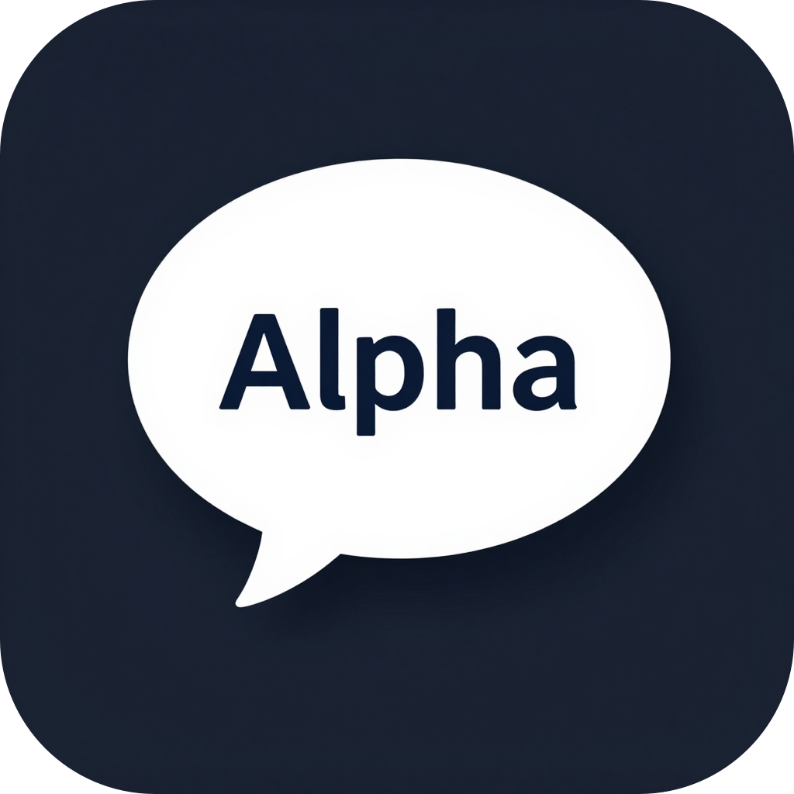

<h2>Alpha</h2>

中文 | [English](README.en.md)

### 一、产品概述

- 开源 AI 代码编辑器，采用 **一切皆插件** 架构，由 [Cordis](https://github.com/cordiverse/cordis) 驱动。
- 桌面端（Tauri）、Web 端与 CLI 共用同一个 agent 内核、会话格式和插件图，一个插件写一次即可在三端装载。
- 安装包内置 Python、Node.js 和 pnpm 三套独立运行时，首次使用即可执行 Python 数据处理、Office 文档读写和 Node 脚本，不依赖用户机器上的系统环境。
- 终端、SSH、子进程、沙箱、LSP、浏览器操作和计算机操作等能力都以插件形式提供，按需启停。
- 会话全程落盘且可回放：任何进入模型请求的输入都能从会话日志中重建，便于审计和复现。
- 应用 ID 为 `org.mutantcat.alpha`，数据目录沿用 `$DSH_HOME`，升级不丢失既有 profile。
- **发行方**：异猫工作群（mutantcat.org），GitHub：https://github.com/Mutantcat-Working-Group

核心价值：

- 让 agent 的能力边界由插件决定，而不是由主循环里的特例决定。
- 让每一次模型请求都能从会话日志完整重建，保证可审计、可回放、可复现。
- 把 Python、Node 和包管理器一起打进安装包，把环境准备从用户侧移到发布侧。
- 让三平台安装包在一条流水线上产出，签名策略与目标平台显式对应。
- 让配置错误在加载期就失败，而不是在运行期被静默跳过。

### 二、功能说明

#### 三端同核

- 桌面端、Web 端与 CLI 共享同一个 agent 内核与会话格式。
- 任务描述后 agent 自行规划、调用工具并汇报；运行中的任务、排队输入和后台作业在重启时给出中断提示。

#### 内置运行时

- 安装包自带 Python、Node.js、pnpm，无需手动准备解释器或 pip 环境。
- 桌面版左下角显示更新状态，支持自动下载和重启安装。

#### 会话可审计

- 会话全程落盘，模型可见输入都有对应日志事件，可回放、可复现。
- 任何进入模型请求的输入都能从会话日志重建，便于审计和排查。

### 三、安装与下载

1. 桌面端：从 [Releases](https://github.com/Mutantcat-Working-Group/Alpha/releases) 下载对应平台的安装包，双击即可安装运行，无需额外配置。Windows 输出 NSIS 安装程序，macOS 输出 ad-hoc 签名的 DMG（Apple Silicon 与 Intel 各一个），Linux 输出 AppImage。
2. Web 版：安装 Node.js 后执行 `npx @mutantcat/alpha web`，默认在 `http://127.0.0.1:3080` 打开；`--no-open` 只起服务不打开浏览器。
3. 从源码运行或自行打包见第七节。

### 四、快速上手

1. 首次启动后在输入框描述任务，agent 自行规划、调用工具并汇报结果。
2. 左下角账号区显示更新状态，可手动检查更新；桌面版支持自动下载和重启安装。
3. 需要脚本和数据处理时，agent 直接使用安装包内置的 Python 运行时。
4. 更多细节见 [Web UI 指南](docs/user/guide/index.md)、[架构文档](docs/architecture.md) 和 [开发指南](docs/development.md)。

### 五、插件生态与兼容层

Alpha 不重造插件生态，而是把已有的生态直接接进来。下面每一项都是仓库里真实存在的桥接层，可以单独装载或关闭。

- **DSH 插件协议**：完整保留插件协议与 manifest 约定，[`dsh-plugin`](https://github.com/topics/dsh-plugin) 主题下的插件仓库可直接装载，配置无需改写；`package.json` 的 `dsh.bundle` / `dsh.profile` / `dsh.client` 清单字段保持原样。
- **Claude Code**：子代理桥接（`@mutantcat/dsh-subagent-claude-code`）复用 Claude Code 执行任务；hooks 桥接（`@mutantcat/dsh-hooks-claude-code`）接管其钩子协议；技能读取 `~/.claude/skills`，`CLAUDE.md` 与 `AGENTS.md` 一样被当作指令文件。
- **Codex**：子代理桥接（`@mutantcat/dsh-subagent-codex`）复用 Codex 执行任务；hooks 桥接（`@mutantcat/dsh-hooks-codex`）接管其钩子协议；技能读取 `$CODEX_HOME` 或 `~/.codex` 下的 `skills` 子目录。
- **ACP（Agent Client Protocol）**：通用客户端经 `@mutantcat/dsh-subagent-acp` 接入；反方向的 ACP 服务端随 `acp` profile 提供，可被任何 ACP 客户端驱动。
- **MCP（Model Context Protocol）**：`@mutantcat/dsh-mcp-client` 把外部 MCP 服务器的工具与资源注册进 `ctx.tools`，一条服务器一个配置项，默认不启用任何服务器；`@mutantcat/dsh-mcp-resources` 负责共享资源发现与读取。
- **技能（Skills）**：本地技能来自 `<projectRoot>/.dsh/skills`、自定义目录 `customSkillDirs`，以及上述 Codex / Claude Code 用户根；目录包 `SKILL.md` 与扁平 `<name>.md` 都会被解析，目录被监听，增删改无需重启即进入会话目录。
- **Office 文档技能**：`@mutantcat/dsh-skill-office` 提供 Word、PowerPoint、Excel 的读写、结构检查与交付流程，默认走安装包内置的 Python 环境。
- 插件通过 `ctx.effect()` 与 `ctx.on()` 注册贡献，`register()` 的返回值即注销函数。
- 运行期自修改（`extensions`）保留，用法不变。
- 插件清单使用 `cordis.yml`，裸写的插件名必须出现在解析清单的 `dependencies` 中。
- 插件作者请遵循 [AGENTS.md](AGENTS.md) 与 `docs/`、`.agents/` 中的约定。

### 六、开发进度

- [X] 桌面端外壳与 Web 客户端
- [X] 内置 Python / Node.js / pnpm 运行时
- [X] 三平台 CI 安装包（Windows NSIS、macOS DMG、Linux AppImage）
- [ ] 自动更新通道（当前 release 产物为免凭据构建，不走 Nightly feed）
- [ ] 插件市场与一键安装

### 七、从源码构建与打包

1. 从源码运行需要 Node.js `^22.19` 或 `>=24` 与 pnpm，依次执行 `pnpm install`、`pnpm run build`、`pnpm alpha web`。
2. 自行打包某个平台的安装包，在 `apps/desktop` 下执行 `pnpm run package:ci:tauri:<target>`，`<target>` 取 `mac:arm64`、`mac:x64`、`win:x64`、`linux:x64`、`linux:arm64` 之一。产物落在 `.desktop-build/targets/<target>/artifacts/`。

### 八、社区与贡献

- 在会话中输入 `/feedback`，或对任意回复点赞/点踩并填写分类与详情，反馈会随当前对话日志一并记录。
- 给插件仓库加上 [`dsh-plugin`](https://github.com/topics/dsh-plugin) 主题，便于他人发现。
- agent 参与者遵循 [AGENTS.md](AGENTS.md)。

### 九、安全与许可证

- 运行本项目前请阅读 [SAFETY.md](SAFETY.md)。
- 本项目以 [MIT](LICENSE) 许可证开源。
- 第三方依赖及其许可证见 [THIRD_PARTY_NOTICES.md](THIRD_PARTY_NOTICES.md)。

---

## 致谢

感谢 [Cordis](https://github.com/cordiverse/cordis) 社区与所有为本项目做出贡献的开发者。Alpha 基于开源生态构建，并在此之上独立维护与演进。
